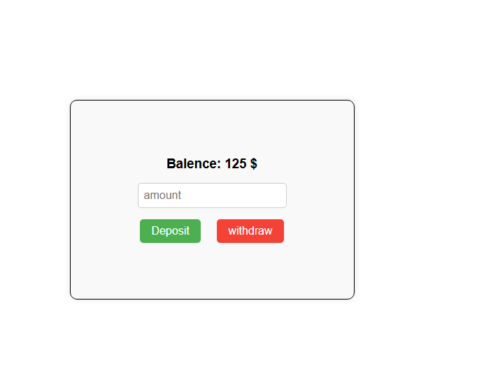
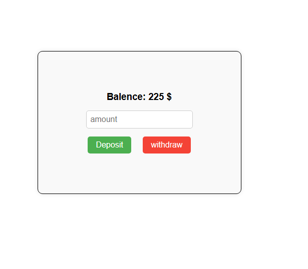
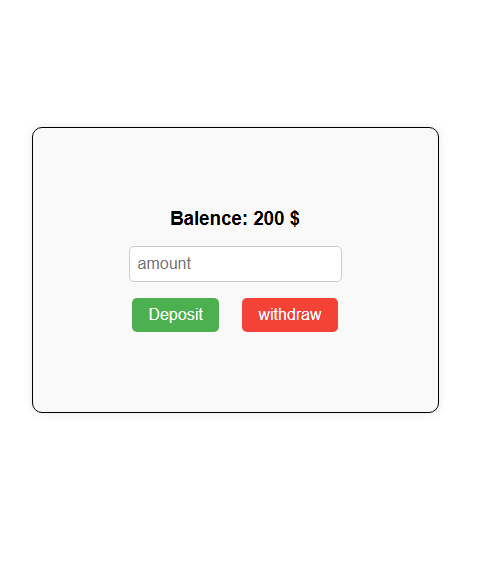

# Bank App

A simple banking application that demonstrates basic account operations:

- **Deposit** ➝ Add money to the account.  
- **Withdraw** ➝ Deduct money from the account.  

---

## Features

**Balance before transaction:**  

### 1. Deposit Money
When the **Deposit** button is clicked, the entered amount is added to the account balance.

---

### 2. Withdraw Money
When the **Withdraw** button is clicked, the entered amount is deducted from the account balance.

---

## Screenshots

**After deposit:**  

**After withdrawal:**  

